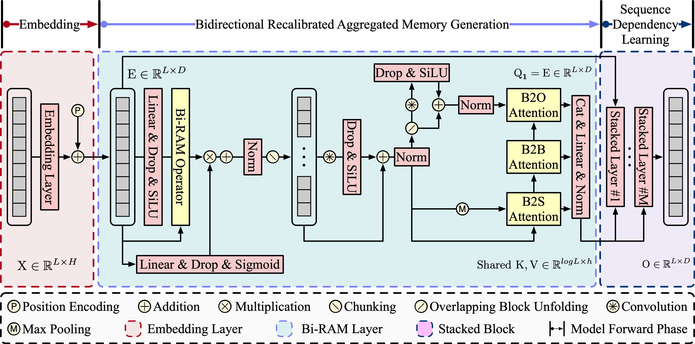

<h1 align="center">Bi-RAM: Bidirectional Recalibrated Aggregated Memory-Based Transformer for Efficient Sequential Modeling</h1>

This is the PyTorch implementation of the Bi-RAM paper.

<p align="center">
  
</p>

> [**Bi-RAM: Bidirectional Recalibrated Aggregated Memory-Based Transformer for Efficient Sequential Modeling**]  
> (Under Review)


## Acknowledgment

This codebase is based on and modified from the excellent open-source implementations of **[MEGA](https://github.com/facebookresearch/mega/tree/main/examples/mega)** and **[Flowformer](https://github.com/thuml/Flowformer/tree/main/Flowformer_TimeSeries)**. We sincerely thank the authors of MEGA and Flowformer for releasing their code and experimental frameworks. The LRA and UEA datasets used in this repository can also be obtained following the data preparation instructions provided in these two projects.


## Repository Structure

To ensure reproducibility, we provide the following core assets:

* `LRA_checkpoint/`: Contains the pre-trained model weights for LRA.
* `out_log/`: Contains the complete training logs. These logs record the hyperparameter settings and configurations used for LRA.
* `run_lra/`: Contains executable shell scripts (`.sh`) for training and evaluation on the LRA benchmark.
* `Biram_TimeSeries/out_log/`: Contains the complete training logs. These logs record the hyperparameter settings and configurations used for UEA.
* `Biram_TimeSeries/results/`: Contains the complete UEA experimental results.
* `Biram_TimeSeries/scripts/biram.sh`: Executable script for training and evaluation on the UEA multivariate time-series classification benchmark.
* `fairseq/`: Contains the core implementation of Bi-RAM for LRA experiments.
* `Biram_TimeSeries/`: Contains the implementation and scripts for UEA time-series classification experiments.


## LRA Data Preparation

Before running the LRA scripts, please download the processed LRA datasets.

The processed LRA data can be obtained from the **[MEGA repository](https://github.com/facebookresearch/mega/tree/main/examples/mega)**.

*Note: The original raw data is from the [Google LRA repository](https://github.com/google-research/long-range-arena).*

Extract the downloaded `lra.zip` to a directory on your machine, and update the `DATA` path in the scripts under `run_lra/` before execution.


## UEA Data Preparation

Before running the UEA scripts, please prepare the UEA multivariate time-series classification datasets.

The UEA data preparation follows the **[Flowformer TimeSeries repository](https://github.com/thuml/Flowformer/tree/main/Flowformer_TimeSeries)**. Please download and organize the datasets according to the instructions provided in the Flowformer project.

After preparing the datasets, place them in your local data directory and update the data path in the scripts under `Biram_TimeSeries/scripts/` before execution.


## How to Use

You can train or evaluate Bi-RAM by running the scripts provided in the corresponding script directories.

For LRA & UEA:

```
bash
cd run_lra
bash lra_all.sh

cd Biram_TimeSeries/scripts/
bash biram.sh
```


## What to do if you encounter errors (Alternative Execution)

If you encounter any errors during training or inference when running this repository directly, you can easily resolve them by integrating our core files into the original MEGA repository.

Simply follow these 3 steps:

1. Copy `fairseq/models/lra/biram_lra_encoder.py` from this repo and paste it into MEGA's `fairseq/models/lra/` directory.
2. Copy `fairseq/modules/biram_sentence_encoder_layer.py` from this repo and paste it into MEGA's `fairseq/modules/` directory.
3. Copy `fairseq/models/lra/model.py` from this repo and **replace** the existing `model.py` in MEGA's `fairseq/models/lra/` directory.

After replacing these specific files, you can directly run the models using MEGA's original pipeline without any issues.
